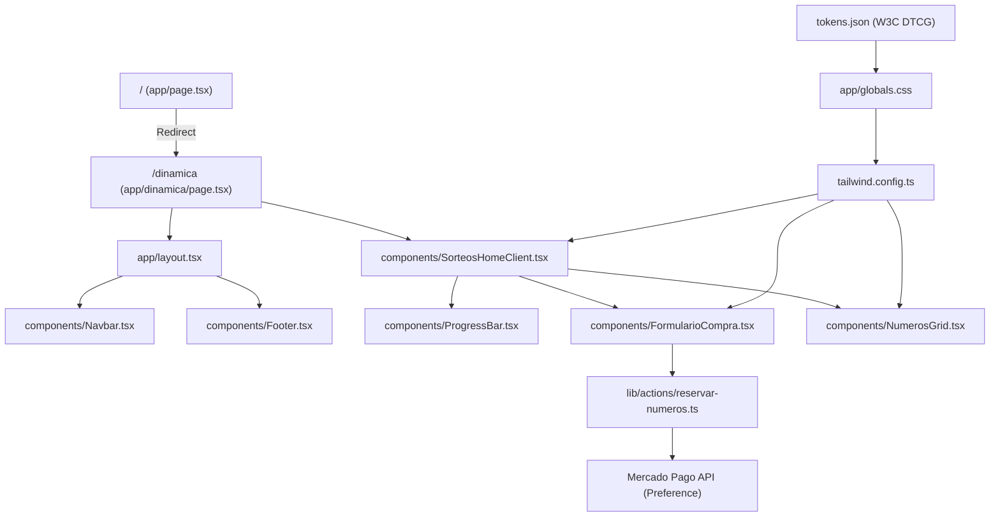

# TiendaMica UI Architecture & Knowledge Graph Report

Generated via **Graphify** skill protocol.

---

## 1. High-Level Domain Graph

---

## 2. Component Taxonomy & Audit Matrix

| Component | Role | Taste & Style Preset | Guidelines & a11y Status |
| :--- | :--- | :--- | :--- |
| [`Navbar.tsx`](file:///C:/Users/blade/OneDrive/Desktop/TiendaMica/components/Navbar.tsx) | Header de navegación y modo oscuro | Boutique Minimal | ✅ Logo con dimensiones explícitas, enlaces con `:focus-visible`, tema accesible. |
| [`SorteosHomeClient.tsx`](file:///C:/Users/blade/OneDrive/Desktop/TiendaMica/components/SorteosHomeClient.tsx) | Contenedor principal de dinámica | Boutique E-Commerce / Bento | ✅ Encabezado balanceado (`text-wrap: balance`), precios `tabular-nums`, soporte dark mode completo en tarjetas. |
| [`FormularioCompra.tsx`](file:///C:/Users/blade/OneDrive/Desktop/TiendaMica/components/FormularioCompra.tsx) | Proceso de compra y checkout MP | Tactile High-Confidence Form | ✅ Etiquetas asociadas `htmlFor`, botones `+/-` con `aria-label`, elipsis tipográfica `…`, validación celular AR en tiempo real. |
| [`ProgressBar.tsx`](file:///C:/Users/blade/OneDrive/Desktop/TiendaMica/components/ProgressBar.tsx) | Indicador visual de meta | Minimalist Metric Track | ✅ Rol `progressbar` con `aria-valuenow`, `aria-valuemin`, `aria-valuemax`, cifras tabulares y adaptación oscura. |
| [`NumerosGrid.tsx`](file:///C:/Users/blade/OneDrive/Desktop/TiendaMica/components/NumerosGrid.tsx) | Tablero interactivo de números | Tactile Grid | ✅ Rol `list`/`listitem` con etiquetas descriptivas accesibles, estados de ganador/ocupado/disponible con alto contraste dark mode. |
| [`Footer.tsx`](file:///C:/Users/blade/OneDrive/Desktop/TiendaMica/components/Footer.tsx) | Pie de página y enlaces institucionales | Calm Institutional | ✅ Enlaces sociales con `aria-label`, iconos con `aria-hidden="true"`, foco por teclado optimizado. |

---

## 3. Design Tokens Architecture (`tokens.json`)

- **Nivel 1 (Primitivos)**:
  - `color.primitive.rose`: Paleta rosada Adonai (50 a 700).
  - `color.primitive.sage`: Paleta verde salvia de confianza (50 a 700).
  - `color.primitive.neutral`: Cream (`#faf8f5`), Dark (`#171416`), Surface (`#ffffff`).
- **Nivel 2 (Semánticos)**:
  - `brand.primary`, `accent.sage`, `surface.card`, `surface.canvas`.
- **Nivel 3 (Componentes)**:
  - Curvas de transición `transition.micro` (`150ms [0.16, 1, 0.3, 1]`) y radios de tarjeta `radius.xl` (`24px`).

---

## 4. Auditoría de Calidad y Verificación
- **Validación DTCG**: Ejecutada exitosamente con `node .agents/skills/design-token/scripts/validate.js tokens.json` (36 tokens válidos).
- **TypeScript**: `tsc --noEmit` completado con 0 errores.
